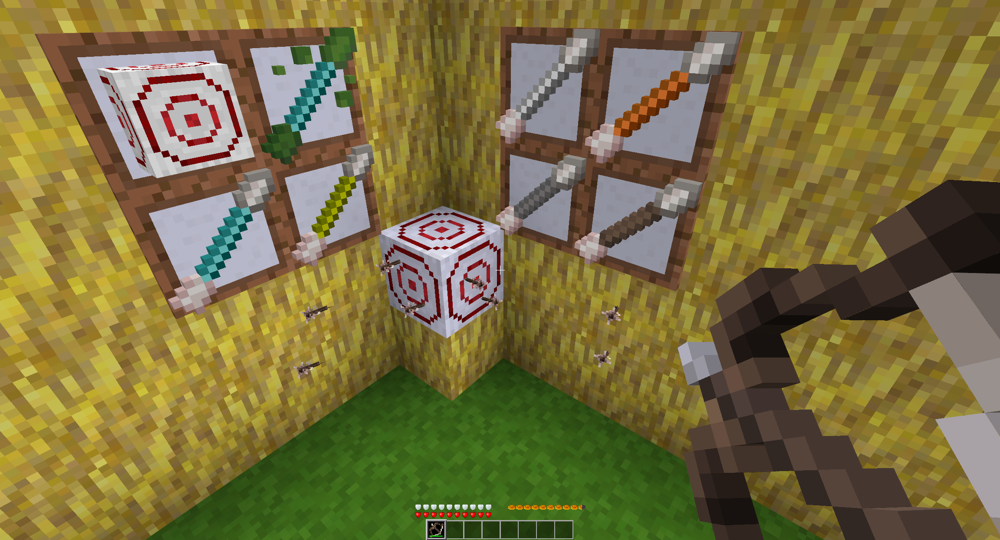

# Bow and Arrows [x_bows]

Adds bow and arrows to Minetest.

<!--  -->

## Features

## Dependencies

- none

## Optional Dependencies

- farming
  - bow and target recipes
- 3d_armor
  - calculates damage including the armor
- hbhunger
  - changes hudbar when poisoned
- mesecons
  - target can be used to trigger mesecon signal
- playerphysics
  - force sneak when holding charged bow

## License:

### Code

GNU Lesser General Public License v2.1 or later (see included LICENSE file)

### Textures

**CC BY-SA 4.0, Pixel Perfection by XSSheep**, https://minecraft.curseforge.com/projects/pixel-perfection-freshly-updated

- x_bows_bow_wood.png
- x_bows_bow_wood_charged.png
- x_bows_arrow_wood.png
- x_bows_arrow_tile_point_top.png
- x_bows_arrow_tile_point_right.png
- x_bows_arrow_tile_point_bottom.png
- x_bows_arrow_tile_point_left.png
- x_bows_arrow_tile_tail.png
- x_bows_arrow_particle.png
- x_bows_arrow_tipped_particle.png
- x_bows_bubble.png
- x_bows_target.png

Modified by SaKeL:

- x_bows_arrow_stone.png
- x_bows_arrow_bronze.png
- x_bows_arrow_steel.png
- x_bows_arrow_mese.png
- x_bows_arrow_diamond.png
- x_bows_arrow_diamond_poison.png

### Sounds

**Creative Commons License, EminYILDIRIM**, https://freesound.org

- x_bows_bow_load.1.ogg
- x_bows_bow_load.2.ogg
- x_bows_bow_load.3.ogg

**Creative Commons License, bay_area_bob**, https://freesound.org

- x_bows_bow_loaded.ogg

**Creative Commons License**, https://freesound.org

- x_bows_bow_shoot_crit.ogg

**Creative Commons License, robinhood76**, https://freesound.org

- x_bows_bow_shoot.1.ogg
- x_bows_arrow_hit.1.ogg
- x_bows_arrow_hit.2.ogg
- x_bows_arrow_hit.3.ogg

**Creative Commons License, natty23**, https://freesound.org

- x_bows_arrow_successful_hit.ogg

## Installation

see: http://wiki.minetest.com/wiki/Installing_Mods
